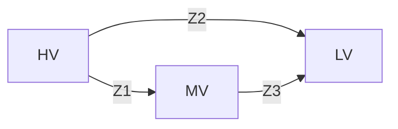

Translation of Energinet TYNDP data to Matpower case format:

Splitting the data in two case files
The Danish system include two separate synchronous zones, DK1 in Western Denmark and DK2 in Eastern Denmark.

## Data conversion

### Buses

### Transmission lines

### 2 winding transformers

#### Data provided:

- Nominal voltage on primary $U_{n.H} [kV]$
- Nominal voltage on secondary $U_{n.L} [kV]$
- Nominal apparent power $S_n[MVA]$
- Percent of nominal primary voltage when secondary is shorted and carrying rated current $u_k[\%]$
- Active power losses during short circuit test $P_{cu}[kW]$
- No load current $I_{NL}[A]$ and no load losses  $P_{NL}[kW]$
- Minimum tap position $t_{min}$ , maximum tap position $t_{max}$, neutral position $t_{neutral}$, current tap position $t_{actual}$ position and incremental tap-voltage magnitude $\Delta U_{Tap}[\%]$ and angle $\Delta U_{angle}[^o]$

The tap ratio is computed as:
$$
n = 1.0 + \left( t_{actual} - t_{neutral}\right)\cdot \Delta U_{Tap}
$$
The transformer phase shift is computed by:
$$
\alpha = \left( t_{actual} - t_{neutral}\right)\cdot \Delta U_{angle}
$$
Short circuit impedance is obtained from:
$$
z_{sc}=\frac{u_{sc}}{100} [\mathrm{pu}]
$$
Short circuit resistance is computed as:
$$
r_{sc}= \frac{P_{cu}}{10^3 \cdot S_n} [\mathrm{pu}]
$$
Leakage reactance is obtained by:
$$
x_{l} = \sqrt{z^2_{sc}-r^2_{sc}} [\mathrm{pu}]
$$

Transformer impedances are referred to high-voltage side by:
$$
X_l = x_l \cdot Z_{base,HV} [\Omega] \\
R_{HV} = r_{sc} \cdot Z_{base,HV}  [\Omega]
$$
**TODO:** Magnetizing reactance and core losses are not implemented in the the current version of the data converter.

### 3 winding transformers

#### Data provided:

- Nominal voltage on high voltage $U_{n.H} [kV]$, medium voltage $U_{n.M} [kV]$ and low voltage $U_{n.L} [kV]$ sides 
- Nominal apparent power $S_{n}[MVA]$
- Relative short circuit voltages:
  - Percent of nominal HV voltage when MV is shorted LV is open circuited: $u_{k.H}[\%]$
  - Percent of nominal MV voltage when LV is shorted HV is open circuited: $u_{k.M}[\%]$
  - Percent of nominal HV voltage when LV is shorted MV is open circuited: $u_{k.L}[\%]$
- Active power losses during short circuit test $P_{cu.H}[kW]$, $P_{cu.M}[kW]$ and $P_{cu.L}[kW]$
- Identification of tapped side winding.
- Minimum tap position $t_{min}$ , maximum tap position $t_{max}$, neutral position $t_{neutral}$, current tap position $t_{actual}$ position and incremental tap-voltage magnitude $\Delta U_{Tap}[\%]$ and angle $\Delta U_{angle}[^o]$

The 3-winding transformers are modeled as three 2-winding transformers in the matpower case. 

$$
z_1 = r_1 + jx_1 = \frac{u_{k.H}}{100\%}, \quad r_1 = \frac{P_{cu.H}}{10^3\cdot S_n}, \quad x_1 = \sqrt{z^2_1 - r^2_1} \\
z_2 = r_2 + jx_2 = \frac{u_{k.M}}{100\%}, \quad r_2 = \frac{P_{cu.M}}{10^3\cdot S_n}, \quad x_2 = \sqrt{z^2_2 - r^2_2} \\
z_3 = r_3 + jx_3 = \frac{u_{k.L}}{100\%}, \quad r_3 = \frac{P_{cu.L}}{10^3\cdot S_n}, \quad x_3 = \sqrt{z^2_3 - r^2_3}
$$

Generators

Loads

Additional cost functions for generators